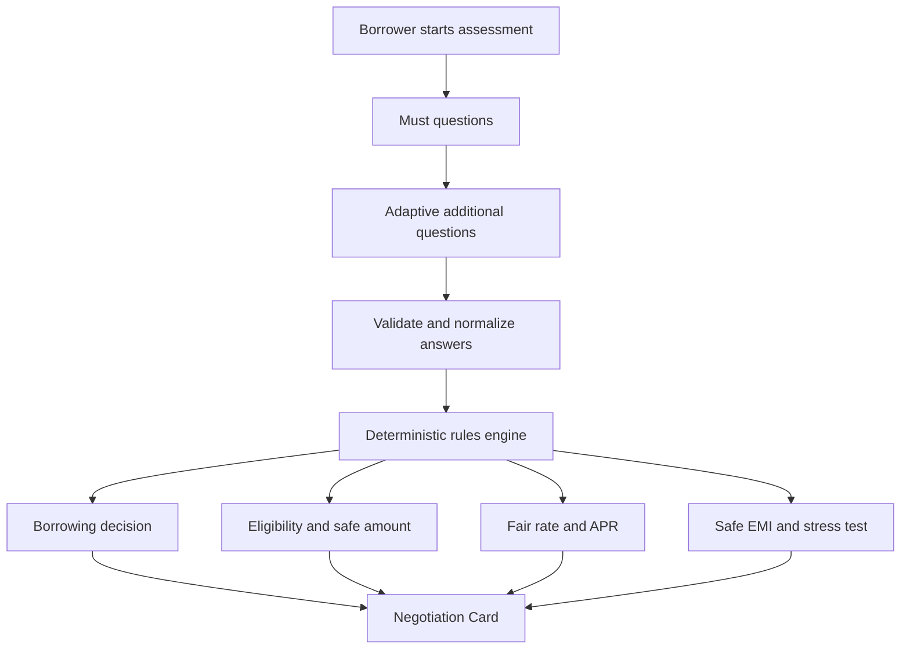

# Borrower Copilot

**Know your numbers before you meet the lender.**

Borrower Copilot is a borrower-side self-assessment tool for Indian borrowers. It helps a borrower understand what they should safely accept before speaking with a bank, NBFC, or app-based lender. The project was built as a take-home challenge prototype, but the product itself is simply Borrower Copilot.

## The Problem

Lenders already have rules to decide what they may approve. Borrowers often do not see those rules, and they may not know whether the offer in front of them is healthy.

Before a lender conversation, a borrower usually wants to know:

- whether borrowing is a good idea
- how much they can safely afford
- what interest rate is reasonable
- what EMI is safe
- whether a lender quote is actually good

Borrower Copilot gives the borrower a simple financial view before they negotiate.

## What the App Gives the Borrower

| Output | What it means | Why it matters |
| --- | --- | --- |
| O1 - Borrowing Decision | A clear verdict: Borrow, Borrow less, or Don't borrow. | The borrower gets a practical recommendation, not only numbers. |
| O2 - Maximum Loan Amount | Two amounts: likely lender sanction and borrower-safe amount. | A lender may approve more than the borrower should safely carry. |
| O3 - Fair Interest Rate | A fair interest-rate range and estimated APR range. | The app avoids fake precision and includes the effect of upfront fees. |
| O4 - EMI / Monthly Outflow | A safe monthly EMI ceiling with tenure and stress context. | The borrower can compare offers against a monthly number they can live with. |

The app also creates a Negotiation Card. This is a one-page summary the borrower can copy, print, or save as a PDF before talking to a lender.

## Negotiation Card

The Negotiation Card is a simple borrower-facing summary. It is meant to help the borrower compare a lender's quote honestly.

It includes:

- recommended borrowing decision
- lender-likely amount
- borrower-safe amount
- fair interest-rate band
- estimated APR
- safe EMI ceiling
- stress-case result
- important reasons
- warnings
- confidence level

The card does not promise approval. It gives the borrower a clear position for the lender conversation.

## Verdict-Specific Behaviour

The app produces three verdicts and adapts all output accordingly.

### Borrow

The borrower can safely proceed. The card shows:

- recommended amount
- borrower-safe range
- lender-likely range
- fair rate and APR
- EMI ceiling with tenure window
- stress test result

### Borrow Less

The borrower can borrow, but the requested amount is more than what is safe. The card shows:

- what the borrower asked for
- recommended reduced amount
- why the reduction matters
- lender-likely amount (for context, not as a target)
- fair rate and APR
- safe EMI ceiling

### Don't Borrow

The borrower should not take a new loan right now. The card shows:

- **Recommended new borrowing: ₹0** with a clear explanation
- **No new EMI** instead of a bare ₹0/month
- **Emergency-only ceiling** if borrowing is unavoidable and some repayment capacity exists
- **Lender-likely amount** de-emphasized with a warning that approval ≠ safety
- **Quote verdict: Unsafe regardless of price** when the issue is cash flow, not pricing
- A clear next step (e.g. reduce high-cost debt first)

If even the emergency ceiling is not supportable, the app says: *"No additional loan is currently supportable from the information provided."*

## Emergency-Only Ceiling

When the verdict is Don't Borrow but the borrower has some residual repayment capacity, the app calculates an emergency-only ceiling. This is:

- explicitly labeled as NOT a recommended target
- calculated using stricter assumptions than normal safe borrowing
- shown separately from the recommended amount (which is always ₹0)
- hidden entirely if the math does not support even a small additional EMI

The emergency ceiling prevents a dangerous situation where the app says "don't borrow" but provides no guidance for a borrower who has no alternatives.

## Quote Safety Assessment

The app compares a lender quote against both pricing fairness and borrower safety.

| Assessment | When it applies |
| --- | --- |
| Good offer | APR is within the borrower-friendly range and structure is sound |
| Reasonable | APR is within range, subject to final KFS check |
| Expensive | The loan structure fails the stress check even if the price is within range |
| Very expensive | APR exceeds the avoid-above threshold |
| Unsafe regardless of price | The verdict is Don't Borrow — the issue is cash flow, not the rate |

A wide market-rate range does not automatically make a high-cost quote "fair." If the verdict is Don't Borrow, no quote is labeled as positive or acceptable, regardless of APR.

## Output-Specific Confidence

Confidence is not a single global number. The app tracks confidence separately for:

| Dimension | What it measures |
| --- | --- |
| Affordability | How well the app knows income, expenses, and obligations |
| Lender sanction | How well the app can predict what a lender might approve |
| Pricing | How precisely the app can estimate rates and APR |
| Product routing | How confident the app is in the recommended product type |

The overall confidence level shown to the borrower is a summary. Internally, each output uses its own confidence dimension to determine how wide to make its range.

If confidence is `high`, the app must not simultaneously cite unknown data as widening the estimate. This consistency is enforced by the validation layer.

## Consistency Validation

The rules engine runs a final consistency check on every assessment. This catches contradictions that would confuse or mislead a borrower. Examples of checked invariants:

- Don't Borrow cannot have a positive recommended amount
- Don't Borrow quote must be Unsafe regardless of price
- Borrow verdict requires positive safe amount
- Borrow Less must recommend strictly less than requested
- High confidence cannot cite unknown data
- A failing stress test cannot produce a positive quote verdict
- Safe EMI must be non-negative and finite
- APR should not fall below the nominal rate when fees are present
- All ranges must be ordered and finite

If any invariant fails, the assessment throws an error rather than silently producing contradictory output.

## Borrower Journey



The borrower answers a short form. The app validates the answers, runs deterministic lending rules, and shows the results with explanations.

## Question Design

Questions are split into must questions and additional questions.

### Must Questions

These are enough to produce the four main outputs:

- loan purpose
- requested loan amount
- product type
- monthly income
- income type
- existing EMIs
- monthly household expenses
- rent or housing cost
- age
- credit score, if known
- recent repayment stress

### Additional Questions

These appear only when they improve a result, confidence, range, recommendation, or explanation.

Examples include:

- employment stability
- income history
- ITR income
- credit utilisation
- repayment history
- emergency savings
- collateral
- co-applicant support
- upcoming expenses
- productive use of the loan
- existing lender offers

The rule is simple: if a question does not change the output or the confidence of the output, it should not be asked.

## Adaptive Questionnaire

Different borrowers see different follow-up questions.

| Borrower type | What the app focuses on |
| --- | --- |
| Priya, salaried borrower | salary stability, existing EMI, credit score, discretionary purpose, safe affordability |
| Ravi, self-employed borrower | documented income, business history, income variability, business purpose, property or collateral |
| Anita, informal-income borrower | income variability, dependents, high-cost debt, recent repayment behaviour, household stress, productive use |

Detailed outputs for these borrowers are in [RUNTHROUGHS.md](./RUNTHROUGHS.md).

## Core Design Principle

### Lender affordability is not the same as borrower affordability.

A lender may be willing to approve ₹8 lakh. Borrower Copilot may recommend that the borrower negotiate closer to ₹6 lakh.

That difference is intentional. A lender may focus on policy, income, collateral, and repayment capacity. A borrower also needs to protect rent, food, school fees, business needs, medical needs, savings, and basic household stability.

This is one of the most important ideas in the project: approval is not the same as safety.

## How the Rules Engine Works

All important lending decisions are made by a deterministic TypeScript rules engine. The app does not use an LLM to calculate financial decisions.

The same input produces the same output every time. The rules are separated from the React UI so they are easier to test, audit, explain, and change during an interview.

```text
Borrower answers
      ↓
Zod validation
      ↓
Normalized borrower profile
      ↓
Rules engine
      ├── eligibility
      ├── affordability
      ├── pricing
      ├── APR
      ├── product routing
      ├── stress testing
      └── confidence
      ↓
Explanation layer
      ↓
Results + Negotiation Card
```

This design avoids hidden model behaviour. A reviewer can inspect the rule files and see why the app reached a result.

## High-Level Financial Logic

### FOIR

FOIR means fixed-obligation-to-income ratio. The app uses it as:

```text
(existing fixed obligations + proposed EMI) / monthly usable income
```

It helps estimate how much income is already committed to debt.

### Lender Affordability

The app estimates how much EMI a lender might tolerate based on the borrower profile, income type, and product type. This is only an estimate. It is not a lender policy engine.

### Borrower-Safe Affordability

The borrower-safe limit is more conservative. It may consider household expenses, dependents, income stability, existing debt, emergency buffer, repayment history, upcoming expenses, and loan purpose.

### EMI

EMI is calculated using standard reducing-balance loan mathematics.

### Maximum Loan Amount

The app can also work backward from a safe EMI to estimate the principal amount the borrower can safely carry.

### Fair Interest-Rate Band

The app estimates a range based on product type, credit profile, income type, stability, documentation, collateral, existing debt, and repayment behaviour.

It does not claim that the range is a guaranteed lender quote.

### APR

APR shows the all-in borrowing cost. It includes the effect of upfront fees such as processing fees, so it can be higher than the headline interest rate.

### Stress Testing

The app checks whether the borrower can still manage the loan under a simple adverse scenario, such as income falling or the interest rate rising.

### Confidence

Confidence depends on how complete and reliable the information is. More specific information creates narrower ranges and higher confidence. Missing information creates wider ranges and lower confidence.

## Unknown Is Not Zero

If the borrower does not know their credit score, the system does not convert it to `0` or assume very bad credit.

Instead, it keeps the value as unknown, widens the range, lowers confidence, and explains why the estimate is less precise.

The same principle applies to other missing information. Unknown data should create uncertainty, not a fake number.

## Explainability

Every major output has a short reason. For example:

> Your safe EMI is lower because you already pay ₹14,000/month toward your car loan.

Or:

> Your fair-rate range is wider because your credit score is unknown.

A borrower should not need to understand lending mathematics to understand the result.

## Product Routing

Borrower Copilot can suggest a better loan route when the answers support it.

For example, Ravi is self-employed and owns unencumbered shop property. The app can route him toward comparing a secured loan-against-property style option instead of treating an expensive unsecured business loan as the only path.

This is not a guarantee of eligibility. It is a prompt to compare a potentially safer product route.

## Architecture

```text
React UI
   ↓
Form / questionnaire layer
   ↓
Zod validation
   ↓
Domain models
   ↓
Deterministic TypeScript rules engine
   ↓
Explanation generator
   ↓
Results / Negotiation Card
```

The project intentionally does not require a backend.

Reasons:

- no login
- no bureau pull
- no database
- no personal data storage
- deterministic calculations
- easier local execution
- lower complexity

The domain engine can later be moved behind a Node.js API if the product needs accounts, consented bureau pulls, or saved assessments.

## Tech Stack

| Area | Technology |
| --- | --- |
| Frontend | React |
| Language | TypeScript |
| Build tool | Vite |
| Styling | Tailwind CSS |
| UI primitives | Local React components styled with Tailwind |
| Icons | Lucide React |
| Forms | React Hook Form |
| Validation | Zod |
| State | React component state |
| Unit testing | Vitest |
| Component testing | React Testing Library |
| E2E testing | Playwright |
| Script runner | tsx |
| Linting | ESLint |

## Project Structure

```text
src/
├── app/
├── components/
│   ├── methodology/
│   ├── negotiation/
│   ├── questionnaire/
│   ├── results/
│   └── ui/
├── domain/
│   ├── calculations/
│   ├── engine/
│   ├── fixtures/
│   ├── rules/
│   └── types.ts
├── features/
│   └── assessment/
├── lib/
├── main.tsx
└── styles.css

tests/
└── e2e/

scripts/
├── check-privacy.mjs
├── generate-rules-doc.ts
├── generate-runthroughs.ts
├── setup-node.sh
└── validate-rules-doc.mjs

README.md
RULES.md
RUNTHROUGHS.md
WALKTHROUGH.md
INTERVIEW_PREP.md
```

## Privacy

The challenge intentionally avoids collecting or storing personal data.

Borrower Copilot has:

- no login
- no bureau integration
- no database
- no analytics SDK
- no browser storage for borrower answers
- no production financial data requirement

Manual answers live in the current React session. A refresh clears them. Demo URLs only store the demo id, such as `?demo=priya`, not borrower financial details.

## Three Reference Borrowers

| Borrower | Profile | Key challenge | What the app reasons about |
| --- | --- | --- | --- |
| Priya | Stable salaried borrower | Eligible amount may be higher than safe amount | salary stability, existing EMI, credit score, discretionary loan purpose, safe EMI |
| Ravi | Self-employed business owner | Income is variable and collateral may change the best product route | documented income, business history, property, secured borrowing, serviceability |
| Anita | Informal income with expensive existing debt | New borrowing may create debt stress | dependents, app debt, recent repayment stress, household surplus, productive use |

The full borrower run-throughs are in [RUNTHROUGHS.md](./RUNTHROUGHS.md).

## Running the Project Locally

Prerequisites:

- Node.js 22 or newer recommended
- npm 10 or newer recommended
- WSL, macOS, or Linux shell

From a fresh checkout:

```bash
git clone <repo-url>
cd borrower-copilot
npm ci
npm run dev
```

Open:

```text
http://127.0.0.1:5173
```

If WSL does not already have Node.js installed, this repository includes a helper:

```bash
./scripts/setup-node.sh
export PATH="$PWD/.tools/node/bin:$PATH"
npm ci
npm run dev
```

The app also supports demo URLs:

```text
http://127.0.0.1:5173/?demo=priya
http://127.0.0.1:5173/?demo=ravi
http://127.0.0.1:5173/?demo=anita
```

## Useful Commands

| Command | What it does |
| --- | --- |
| `npm run dev` | Starts the local Vite app. |
| `npm run build` | Runs TypeScript build checks and creates a production build. |
| `npm run lint` | Runs ESLint. |
| `npm run typecheck` | Runs TypeScript without creating build output. |
| `npm run test` | Runs Vitest unit and component tests once. |
| `npm run test:watch` | Runs Vitest in watch mode. |
| `npm run test:e2e` | Runs Playwright end-to-end tests. |
| `npm run docs:rules` | Regenerates `RULES.md` from the rule catalog. |
| `npm run docs:runthroughs` | Regenerates `RUNTHROUGHS.md` from the current engine. |
| `npm run validate:rules` | Checks that documented rule ids match the catalog. |
| `npm run privacy:check` | Checks source files for forbidden storage or analytics usage. |
| `npm run verify` | Runs docs, validation, privacy, lint, typecheck, tests, and build. |

## Testing Strategy

Financial logic is tested separately from the UI. The test suite currently has **70 automated tests** across 5 test files.

### Unit Tests

Unit tests cover EMI calculations, inverse principal calculations, APR behaviour, affordability rules, confidence handling, stress logic, and borrowing decision rules.

### Persona Regression Tests

Each of the three reference borrowers has dedicated regression tests:

- **Anita**: verdict is Don't Borrow, recommended amount is ₹0, quote is Unsafe regardless of price, stress fails, no active tenure, confidence explanation does not contradict label
- **Priya**: high affordability confidence, narrower pricing range than unknown-score borrower, lender sanction exceeds safe amount, quote comparison is consistent
- **Ravi**: thin-file is not treated as poor credit, secured route considered, collateral does not automatically grant maximum capacity

### Edge-Case Fixtures

12 additional test personas cover specific edge cases:

| Fixture | Scenario |
| --- | --- |
| A | High salary, huge rent and EMIs |
| B | Low income, no existing debt |
| C | Unknown expenses (must not equal zero) |
| D | Excellent score, unstable job |
| E | Poor score, strong cash flow |
| F | Existing EMI ending next month |
| G | Medical emergency |
| H | Productive business, uncertain projected income |
| I | Strong borrower asking for too much |
| J | Strong borrower, modest amount |
| K | Severe debt stress |
| L | High collateral, low documented income |

### Invariant Tests

Monotonicity and safety invariants are tested:

- increasing existing EMI must not increase safe borrowing capacity
- decreasing income must not increase safe borrowing capacity
- increasing household expenses must not increase safe borrowing capacity
- adding a recent delinquency must not improve pricing
- Don't Borrow always has ₹0 recommended amount
- Borrow always has positive safe amount
- ranges are always ordered and non-negative

### Boundary Tests

Values at important thresholds:

- credit score just below and above a tier boundary
- very small requested loan size
- requested amount equal to safe maximum

### Fuzz Tests

30 randomly generated borrower profiles verify:

- the engine never crashes
- no NaN or Infinity in any output
- no negative loan amounts
- ranges remain ordered
- verdict is always valid
- every result contains an explanation
- consistency validation passes

### UI and Component Tests

React Testing Library tests cover questionnaire behaviour, validation, and adaptive questions.

### End-to-End Tests

Playwright tests cover the complete borrower journeys for Priya, Ravi, and Anita. They also check demo loading, result rendering, the Negotiation Card flow, and mobile behaviour.

## Design Decisions

### Deterministic Rules Instead of AI-Generated Financial Decisions

Financial outputs should be reproducible, auditable, and explainable. The same inputs should always produce the same result.

### Frontend-Only Architecture

The product does not need a backend for this prototype. Keeping it frontend-only makes setup faster, avoids stored personal information, and reduces failure points.

### Ranges Instead of Fake Precision

Borrower data may be incomplete, lender policies differ, and market pricing changes. Ranges are more honest than a single overconfident number.

### Separate Lender and Borrower Limits

A lender approval amount is not always a healthy borrowing amount. The app shows both numbers so the borrower can negotiate from a safer position.

### Centralized Rules

Rules live in one domain area so they are easy to inspect, test, and change during a live interview.

### Recommended Amount vs Emergency Ceiling

The recommended amount and the emergency-only ceiling are separate concepts. A borrower should never confuse "the most you could possibly tolerate" with "the amount you should borrow." The app keeps them visually and logically distinct.

### Market Pricing vs Fair Pricing

A lender may offer 30–40% APR to a high-risk borrower. That does not make it "fair." The app distinguishes the borrower-friendly target range from the likely market range, and adds an avoid-above APR threshold so borrowers do not accept predatory terms.

### Safety Over Precision

Whenever the app must choose between a technically correct number and a number that could mislead a borrower, it prefers the safer and clearer presentation.

## Rules and Assumptions

The README keeps business-rule details high level. The detailed rule table is in [RULES.md](./RULES.md).

`RULES.md` contains thresholds, assumptions, interest-rate bands, income adjustments, FOIR assumptions, product assumptions, stress assumptions, reasoning, sources, and judgement notes.

## Detailed Borrower Run-Throughs

[RUNTHROUGHS.md](./RUNTHROUGHS.md) contains the detailed assessment outputs for Priya, Ravi, and Anita.

It includes questions asked, results, reasons, and Negotiation Card content generated from the current rules engine.

## Walkthrough

[WALKTHROUGH.md](./WALKTHROUGH.md) contains the short product walkthrough, important design choices, what would be built next, and what was intentionally cut.

## Limitations

Borrower Copilot is intentionally limited.

Known limitations:

- no real bureau pull
- no lender-specific underwriting model
- rate bands are estimates
- income information is self-reported
- lender policies change
- no bank-statement analysis
- no guarantee of sanction
- simplified stress scenarios
- limited product coverage
- no collateral title or valuation verification

The app is useful for borrower education and negotiation preparation, but it is not a final lending decision.

## What I Would Build Next

Practical next steps:

- real bureau integration with explicit borrower consent
- bank-statement analysis
- lender-offer comparison
- configurable lender-policy engine
- saved assessments with explicit consent
- regional-language support
- improved secured-loan routing
- real lender rate feeds
- more detailed cash-flow stress testing
- downloadable or shareable negotiation card

## Disclaimer

This project provides an educational self-assessment and estimated borrowing guidance. It does not provide guaranteed loan eligibility, financial advice, or a lender sanction decision.
